<div align="center">

# 🚀 VyomExtract

### *End-to-End AI-Powered GST Invoice Intelligence*

[](https://python.org)
[](https://streamlit.io)
[](https://pytorch.org)
[](https://huggingface.co)
[](https://ollama.com)
[](LICENSE)

---

**Transform chaotic invoices into structured intelligence — handwritten or digital, VyomExtract reads them all.**

[Problem](#-2-problem-statement) · [Solution](#-4-proposed-solution) · [Architecture](#-10-system-architecture) · [Tech Stack](#-14-technology-stack) · [Getting Started](#-16-implementation-approach)

</div>

---

## 📛 1. Project Name

> **VyomExtract** — AI-Powered GST Invoice Intelligence System
>
> *Problem Statement 3: End-to-End AI-Powered GST Invoice Intelligence*

---

## 🔍 2. Problem Statement

India processes over **800 million GST invoices per month**, yet a significant portion of small-to-medium businesses still rely on handwritten receipts and non-standardized formats. Processing these financial documents is challenging because invoices arrive in highly diverse formats — perfectly structured digital files (Excel, CSV), unstructured documents (PDFs), and low-quality images (JPEG, PNG) of handwritten receipts.

The core problem is that **traditional OCR fails on handwritten GST invoices and complex table layouts** — studies show error rates exceeding 30% on non-standard handwriting — breaking downstream accounting workflows. Manual re-entry costs businesses an estimated **₹15–20 per invoice** and introduces human errors. A robust system is needed to intelligently route, read, and standardize these varied inputs into validated, machine-readable records.

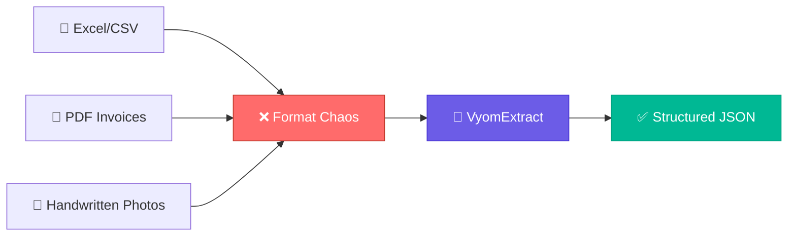

---

## 🌐 3. Project Overview

VyomExtract is an end-to-end document intelligence pipeline designed for **VYOM+** that converts diverse transaction documents into accurate financial records. It uses an intelligent router to detect the file type and sends it to either a structured data pipeline or an unstructured vision-AI pipeline. By leveraging state-of-the-art open-source **Vision-Language Models (VLMs)**, the system can natively "read" handwritten and printed invoices without relying solely on fragile traditional OCR.

---

## 💡 4. Proposed Solution

The solution is a **dual-pipeline architecture**:

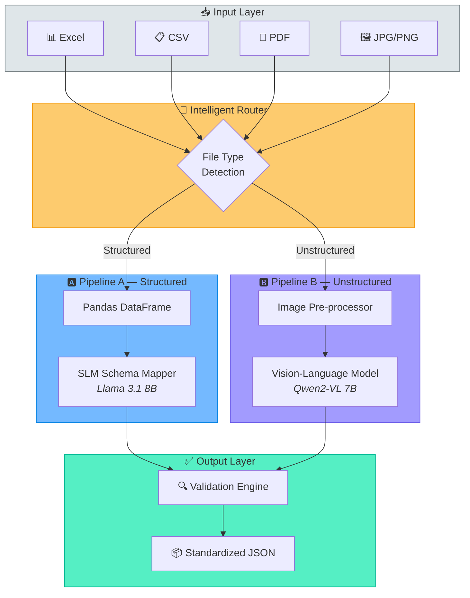

- **Pipeline A (Structured):** Processes Excel and CSV files using an open-source Small Language Model (SLM) to map varying column headers to a standardized GST schema.
- **Pipeline B (Unstructured):** Processes PDFs, JPEGs, and PNGs using a powerful open-source VLM (Qwen2-VL or Llama 3.2 Vision). Instead of extracting text blindly, the VLM comprehends the document layout, extracting handwritten GST details, line items, and financial totals accurately.

Both pipelines feed into a validation layer that mathematically verifies the extracted data before outputting a standardized JSON format.

---

## 🎯 5. Objectives

| # | Objective | Status |
|---|-----------|--------|
| 1 | 🔄 Identify and route input documents (Excel, CSV, PDF, JPG, PNG) automatically | 🟡 Planned |
| 2 | 🔎 Extract critical invoice, GST, tax, and line-item information from printed & handwritten docs | 🟡 Planned |
| 3 | 📊 Organize spreadsheet data into a clean tabular format | 🟡 Planned |
| 4 | ✅ Validate extracted data (e.g., Taxable Value + GST = Total) and handle inconsistencies | 🟡 Planned |
| 5 | 🖥️ Provide a Streamlit-based web interface for evaluators | 🟡 Planned |

---

## 👥 6. Target Users / Use Case

<table>
<tr>
<td width="50%">

### 🎯 Target Users
- 🧑‍💼 Evaluators
- 📊 Accounting Teams
- 📈 Financial Analysts
- 🖥️ ERP System Administrators

</td>
<td width="50%">

### 📋 Use Case
Automating the data entry process for a company that receives a **mixed batch** of digital spreadsheets, system-generated PDFs, and photos of handwritten GST receipts from vendors.

</td>
</tr>
</table>

---

## 🤖 7. Open-Source AI Technology Selected

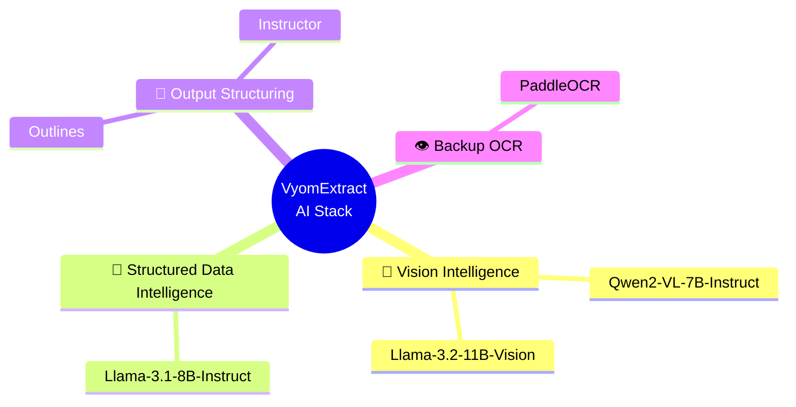

| Component | Model / Library | Role |
|-----------|----------------|------|
| 🧠 Primary Vision | `Qwen2-VL-7B-Instruct` | Reads & understands invoice images |
| 🧠 Alt Vision | `Llama-3.2-11B-Vision-Instruct` | Fallback vision model |
| 📝 Structured Data | `Llama-3.1-8B-Instruct` | Maps Excel/CSV columns to GST schema |
| 🔧 Schema Enforcement | `Instructor` / `Outlines` | Forces valid JSON output from LLMs |
| 👁️ Backup OCR | `PaddleOCR` | Dense printed text extraction |

---

## 🧪 8. Why This Technology Was Selected

> **Why VLMs over traditional OCR?**

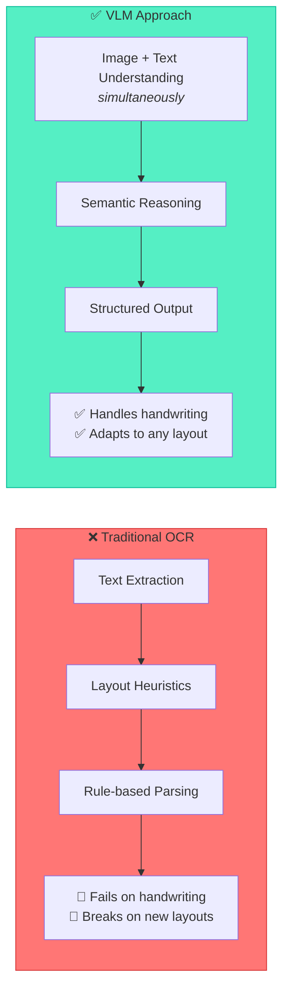

### Why Qwen2-VL specifically?

| Criteria | Why Qwen2-VL-7B Wins |
|----------|----------------------|
| **Architecture** | Uses Naive Dynamic Resolution — processes images at their native resolution without distortion, critical for invoices of varying sizes |
| **Multilingual** | Natively supports English, Hindi, and regional scripts commonly found on Indian GST invoices |
| **Document Understanding** | Benchmarked at **84.5% on DocVQA** — one of the highest scores among open-weight models in its size class |
| **Size vs. Performance** | At 7B parameters, it can be quantized to 4-bit (~4GB VRAM) while retaining strong extraction quality — feasible on hackathon hardware |
| **Open Weights** | Apache 2.0 licensed — fully compliant with the open-source AI requirement |

### Why an SLM for structured data instead of the same VLM?

Excel/CSV files are already text — sending them through a vision pipeline wastes compute. A text-only **Llama 3.1 8B** is **~3× faster** for schema mapping tasks because it skips the entire image encoder. This keeps Pipeline A lightweight and responsive while reserving GPU headroom for the heavier VLM on Pipeline B.

### Why Instructor/Outlines for output structuring?

LLMs generate free-form text by default. Without guardrails, the model can hallucinate extra fields or produce malformed JSON. **Instructor** constrains the LLM's token generation to only produce output conforming to a Pydantic schema — this is not post-processing; it is **enforced during generation**, making invalid output structurally impossible.

---

## 🧩 9. AI's Role in the System

AI is the **core intelligence layer** of the system. Rather than using hardcoded rules (which break when an invoice layout changes), the AI dynamically reasons about the document:

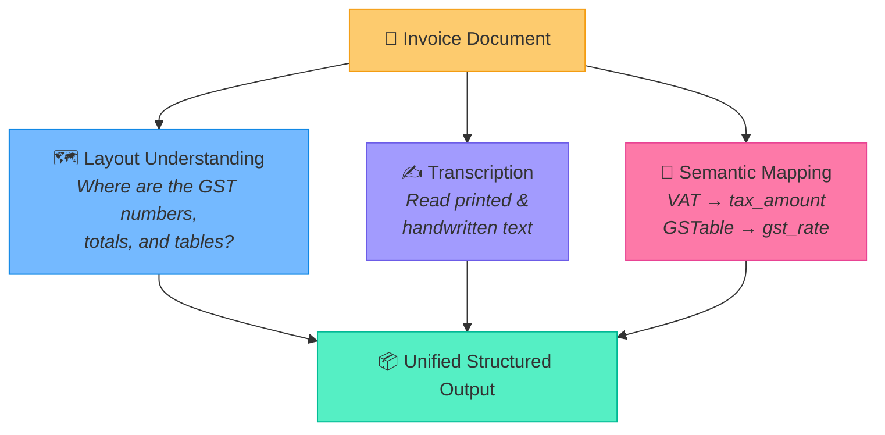

---

## 🏗️ 10. System Architecture

The system follows a modular, feed-forward architecture:

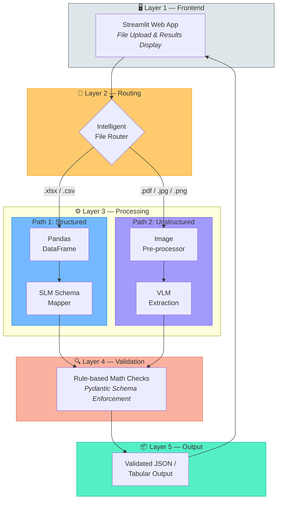

---

## 🧱 11. Component-Level Architecture

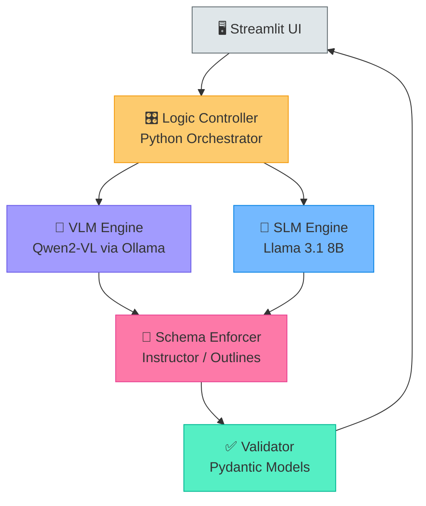

Each component exists for a specific reason in the pipeline:

| Component | Technology | Why It's Needed |
|-----------|-----------|----------------|
| **UI** | Streamlit | Chosen over Flask/Django because it provides a **zero-boilerplate** file upload + data display interface — critical for a 12-hour hackathon where UI time must be minimized |
| **Logic Controller** | Python | Orchestrates routing decisions and pipeline execution. A single entry point prevents spaghetti code and makes the system testable |
| **VLM Engine** | Qwen2-VL via Ollama | Ollama provides **one-command model deployment** (`ollama run qwen2-vl`) with automatic quantization — no manual CUDA/PyTorch setup needed during the hackathon |
| **SLM Engine** | Llama 3.1 8B | Handles text-only schema mapping **3× faster** than routing structured data through the vision pipeline |
| **Schema Enforcer** | Instructor | Constrains LLM output **during generation** (not post-hoc regex) to guarantee valid JSON every time |
| **Validator** | Pydantic | Provides mathematical verification (e.g., `taxable + cgst + sgst == total`) that the AI layer cannot guarantee on its own |

---

## 🔄 12. Data/Information Flow

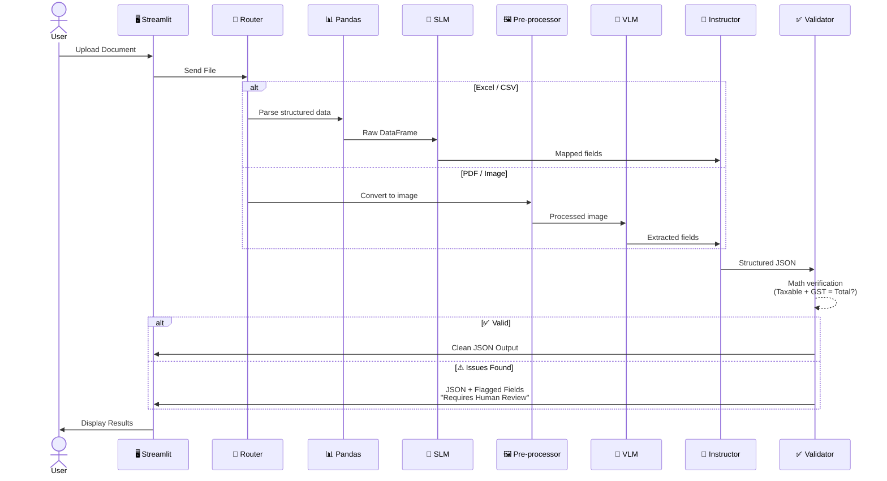

---

## 🤝 13. Agentic Workflow

The system utilizes a lightweight sequential agentic workflow:

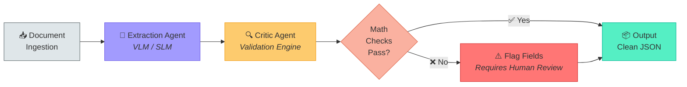

- **Extraction Agent:** The VLM extracts the raw data.
- **Critic/Validation Agent:** A rule-based script checks the math. If an error is found (e.g., GST doesn't match the total), the script flags the specific field as "Uncertain/Requires Human Review" rather than failing silently.

---

## 🛠️ 14. Technology Stack

| Category | Technology | Why This Choice | Badge |
|----------|-----------|----------------|-------|
| **Language** | Python 3.10+ | Richest AI/ML ecosystem; native support for all selected models and libraries |  |
| **Frontend** | Streamlit | Rapid prototyping with built-in file upload widgets — deployable UI in <50 lines of code |  |
| **AI/ML** | HuggingFace Transformers, PyTorch, Ollama | Industry-standard model loading + Ollama for one-command local inference without cloud dependency |  |
| **Data Processing** | Pandas, PyMuPDF | Pandas for tabular manipulation; PyMuPDF chosen over pdf2image for **3× faster** PDF→Image conversion with lower memory usage |  |
| **Validation** | Pydantic, Instructor / Outlines | Pydantic enforces schema at runtime; Instructor hooks directly into the LLM's generation loop for **guaranteed** structured output |  |

---

## ✨ 15. Expected Features

- 🔄 **Dynamic file-type routing** — automatic detection and pipeline assignment
- ✍️ **Handwritten extraction** — high-accuracy reading of handwritten GST and invoice data
- 📊 **Spreadsheet parsing** — automated parsing of structured Excel/CSV files
- 🧮 **Math validation** — strict mathematical verification of financial amounts
- 🖥️ **Interactive UI** — clean Streamlit interface for evaluators to upload files and view JSON outputs

---

## 📅 16. Implementation Approach

For the final hackathon round, the implementation will be executed in phases:

```mermaid
gantt
    title 🏗️ VyomExtract — 12-Hour Build Plan
    dateFormat HH:mm
    axisFormat %H:%M

    section 🖥️ Phase 1 — Foundation
        Streamlit UI Setup           :p1a, 00:00, 1h
        File Router Logic            :p1b, after p1a, 1h
        Pandas Excel/CSV Parser      :p1c, after p1b, 1h

    section 🧠 Phase 2 — AI Integration
        VLM Setup (Qwen2-VL)         :p2a, after p1c, 2h
        Prompt Engineering           :p2b, after p2a, 1.5h
        SLM Schema Mapping           :p2c, after p2b, 1.5h

    section ✅ Phase 3 — Validation
        Pydantic Schema Models       :p3a, after p2c, 1h
        Math Validation Logic        :p3b, after p3a, 1h

    section 🚀 Phase 4 — Polish
        End-to-End Testing           :p4a, after p3b, 0.5h
        Bug Fixes & Integration      :p4b, after p4a, 0.5h
        Final Demo Prep              :p4c, after p4b, 1h
```

| Phase | Timeline | Focus |
|-------|----------|-------|
| 🖥️ **Phase 1** | Hours 1–3 | Build the Streamlit UI, the file router, and the basic Pandas logic for Excel/CSV |
| 🧠 **Phase 2** | Hours 4–8 | Integrate the VLM (Qwen2-VL) via a local inference engine. Prompt engineer for invoice extraction |
| ✅ **Phase 3** | Hours 9–11 | Implement validation logic (Pydantic) to force clean JSON output and flag mathematical errors |
| 🚀 **Phase 4** | Hour 12 | End-to-end testing, bug fixing, and final system integration |

---

## 🎯 17. Expected Final Output

> A functional prototype (web app) where a user can upload any supported document format. The system will instantly display the document alongside a **standardized, machine-readable JSON object** containing the supplier details, GST number, line items, and validated tax totals.

```json
{
  "invoice_number": "INV-2026-0847",
  "supplier": {
    "name": "Sharma Electronics Pvt. Ltd.",
    "gstin": "07AABCS1429B1ZS"
  },
  "line_items": [
    {
      "description": "LED Monitor 27\"",
      "hsn_code": "8528",
      "quantity": 5,
      "unit_price": 12500.00,
      "taxable_value": 62500.00,
      "cgst": 5625.00,
      "sgst": 5625.00,
      "total": 73750.00
    }
  ],
  "totals": {
    "taxable_value": 62500.00,
    "total_cgst": 5625.00,
    "total_sgst": 5625.00,
    "grand_total": 73750.00
  },
  "validation": {
    "status": "✅ PASS",
    "checks_run": ["line_item_math", "gst_rate_consistency", "total_reconciliation"]
  }
}
```

---

## 🔮 18. Future Scope / Scalability

### 💥 Potential Impact

| Metric | Current (Manual) | With VyomExtract |
|--------|-----------------|------------------|
| **Processing time per invoice** | 3–5 minutes | <10 seconds |
| **Cost per invoice** | ₹15–20 (manual entry) | Near-zero (automated) |
| **Error rate** | 5–8% (human fatigue) | <2% (AI + validation) |
| **Handwritten invoice support** | Manual only | Fully automated |

### 🚀 Scalability Roadmap

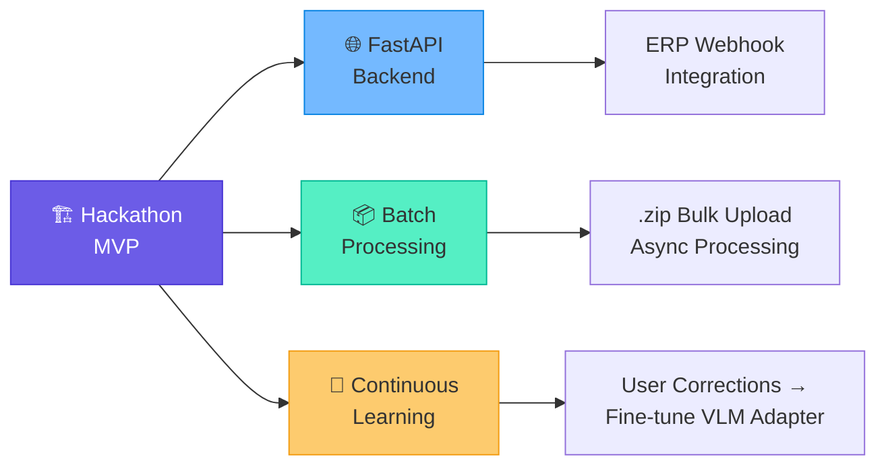

- 🌐 **API Integration:** Wrapping the Python logic in a FastAPI backend so ERP systems can automatically send files to VyomExtract via webhooks. This transforms the prototype from a demo into a **production-ready microservice**.
- 📦 **Batch Processing:** Allowing bulk uploads of `.zip` files containing hundreds of invoices for asynchronous processing. At scale, this could process **10,000+ invoices/day** with GPU acceleration.
- 🧠 **Continuous Learning:** Allowing users to manually correct extraction errors in the UI to fine-tune a specialized LoRA adapter for the VLM over time — improving accuracy on company-specific invoice formats without retraining the full model.

---

## 📦 19. Open-Source Dependencies / Components

| Dependency | Purpose | Link |
|------------|---------|------|
| `qwen2-vl-7b` / `llama-3.2-11b-vision` | 🧠 Core Vision AI | [Qwen2-VL](https://huggingface.co/Qwen/Qwen2-VL-7B-Instruct) |
| `llama-3.1-8b` | 📝 Core SLM | [Llama 3.1](https://huggingface.co/meta-llama/Llama-3.1-8B-Instruct) |
| `streamlit` | 🖥️ UI Framework | [Streamlit](https://streamlit.io) |
| `pandas` | 📊 Data Manipulation | [Pandas](https://pandas.pydata.org) |
| `instructor` | 🔧 Structured LLM Output | [Instructor](https://github.com/jxnl/instructor) |
| `pymupdf` | 📄 PDF Processing | [PyMuPDF](https://pymupdf.readthedocs.io) |
| `paddleocr` | 👁️ Fallback OCR | [PaddleOCR](https://github.com/PaddlePaddle/PaddleOCR) |

---

## ⚠️ 20. Expected Challenges and Mitigation

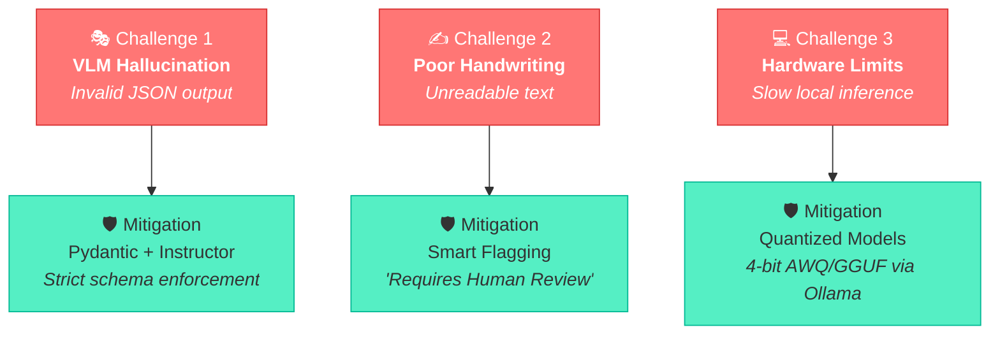

| Challenge | Mitigation |
|-----------|------------|
| 🎭 VLM hallucinating data or outputting invalid JSON formats | Use Pydantic and `Instructor`/`Outlines` to strictly enforce the output schema, preventing the VLM from generating anything other than valid JSON |
| ✍️ Extremely poor handwriting that the VLM cannot read | The validation layer will recognize if critical fields (like GSTIN) are missing or mathematically impossible. It will tag these invoices with a "requires human review" flag rather than crashing |
| 💻 Hardware limitations during local inference | Use heavily quantized versions (e.g., 4-bit AWQ or GGUF formats) of the open-source models via Ollama to ensure smooth performance during the hackathon demo |

---

<div align="center">

**Built with ❤️ for Hacktober 2026**

*VyomExtract — Because every invoice deserves to be understood.*

</div>
